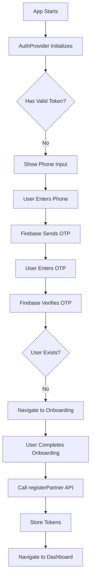
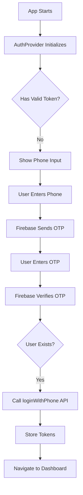
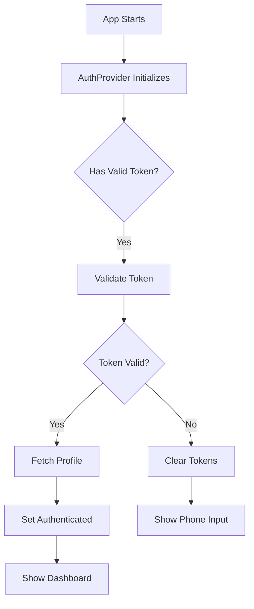

# 🔐 Authentication System Architecture

**Last Updated:** October 2024  
**Version:** 2.0.0 (Complete Overhaul)  
**Status:** Production Ready

---

## 📋 Overview

The TiffinWale Partner App uses an **enterprise-level Firebase Phone OTP authentication system** with centralized token management, automatic refresh, and proper route protection.

### Key Features
- ✅ Firebase Phone OTP Authentication (Indian numbers +91)
- ✅ Centralized Token Management (platform-aware storage)
- ✅ Automatic Token Refresh (before expiry)
- ✅ Unified API Client (single axios instance)
- ✅ Route Protection (public/private guards)
- ✅ Session Persistence (survives app restart)
- ✅ Auto-Login After Registration
- ✅ Clean, Maintainable Architecture

---

## 🏗️ Architecture Overview

```
┌─────────────────────────────────────────────────────────────┐
│                     App Entry Point                          │
│                   app/_layout.tsx                            │
│                   ├── AuthProvider (Initialize auth)         │
│                   └── Slot (Routes)                          │
└─────────────────────────────────────────────────────────────┘
                              │
                ┌─────────────┴─────────────┐
                │                            │
┌───────────────▼──────────┐  ┌──────────────▼────────────┐
│   Public Routes          │  │   Protected Routes         │
│   app/(auth)/*           │  │   app/(tabs)/*             │
│   ├── PublicRoute Guard  │  │   ├── AuthGuard            │
│   ├── phone-input        │  │   ├── dashboard            │
│   └── otp-verification   │  │   ├── orders               │
└──────────────────────────┘  │   └── profile              │
                              └───────────────────────────┘
                                        │
                        ┌───────────────┴────────────────┐
                        │                                 │
            ┌───────────▼──────────┐        ┌───────────▼──────────┐
            │   Auth Store         │        │   API Client          │
            │   (Zustand)          │◄───────┤   (Axios)             │
            │   - State            │        │   - Interceptors      │
            │   - Actions          │        │   - Auto Refresh      │
            └──────────┬───────────┘        └───────────┬───────────┘
                       │                                 │
                       │                                 │
            ┌──────────▼────────────┐        ┌──────────▼──────────┐
            │   Token Manager       │        │   API Services       │
            │   - SecureStore       │        │   - auth.service     │
            │   - AsyncStorage      │        │   - partner.service  │
            │   - Auto Refresh      │        │   - order.service    │
            └───────────────────────┘        └─────────────────────┘
```

---

## 📁 File Structure

```
lib/
├── auth/
│   ├── TokenManager.ts          # Enterprise token management
│   └── AuthProvider.tsx         # Auth initialization wrapper
├── api/
│   ├── client.ts                # Unified axios client
│   ├── index.ts                 # Unified API export
│   └── services/
│       ├── auth.service.ts      # Authentication endpoints
│       ├── partner.service.ts   # Partner endpoints
│       └── order.service.ts     # Order endpoints
config/
└── index.ts                     # Centralized configuration
store/
└── authStore.ts                 # Authentication state (Zustand)
services/
└── phoneAuthService.ts          # Firebase phone auth
components/
└── auth/
    ├── AuthGuard.tsx            # Protected route wrapper
    └── PublicRoute.tsx          # Public route wrapper
app/
├── _layout.tsx                  # Root layout with AuthProvider
├── (auth)/
│   ├── _layout.tsx              # Auth layout with PublicRoute
│   ├── phone-input.tsx          # Phone number entry
│   └── otp-verification.tsx     # OTP verification
└── (tabs)/
    └── _layout.tsx              # Tabs layout with AuthGuard
```

---

## 🔄 Authentication Flow

### 1. New User Flow



### 2. Existing User Flow



### 3. Returning User Flow



---

## 🔐 Token Management

### TokenManager Class

Location: `lib/auth/TokenManager.ts`

**Features:**
- Platform-aware storage (SecureStore for mobile, AsyncStorage for web)
- Memory caching for performance
- Automatic token refresh before expiry (5-minute buffer)
- Thread-safe refresh (prevents concurrent calls)
- Comprehensive logging for debugging

**Key Methods:**
```typescript
class TokenManager {
  // Store tokens securely
  async storeTokens(accessToken: string, refreshToken: string): Promise<void>
  
  // Get access token (auto-refresh if needed)
  async getAccessToken(): Promise<string | null>
  
  // Manually refresh access token
  async refreshAccessToken(): Promise<string | null>
  
  // Validate token without network call
  validateToken(token: string): TokenValidation
  
  // Store/get user data
  async storeUserData(userData: UserData): Promise<void>
  async getUserData(): Promise<UserData | null>
  
  // Check authentication status
  async isAuthenticated(): Promise<boolean>
  
  // Clear all stored data
  async clearAll(): Promise<void>
}
```

**Token Storage Keys:**
```typescript
{
  accessToken: '@tiffin_partner_access_token',
  refreshToken: '@tiffin_partner_refresh_token',
  userData: '@tiffin_partner_user_data',
  authState: '@tiffin_partner_auth_state',
}
```

---

## 🌐 API Client

### Unified API Client

Location: `lib/api/client.ts`

**Features:**
- Single axios instance for all API calls
- Automatic token injection
- Automatic token refresh on 401 errors
- Request/response interceptors
- Retry logic with exponential backoff
- Consistent error handling

**Request Interceptor:**
```typescript
apiClient.interceptors.request.use(async (config) => {
  // Skip public endpoints
  if (isPublicEndpoint(config.url)) return config;
  
  // Get and inject token
  const token = await tokenManager.getAccessToken();
  if (token) {
    config.headers.Authorization = `Bearer ${token}`;
  }
  
  return config;
});
```

**Response Interceptor:**
```typescript
apiClient.interceptors.response.use(
  response => response,
  async error => {
    // Handle 401 - Token expired
    if (error.response?.status === 401 && !originalRequest._retry) {
      originalRequest._retry = true;
      
      // Attempt token refresh
      const newToken = await tokenManager.refreshAccessToken();
      
      if (newToken) {
        // Retry original request with new token
        originalRequest.headers.Authorization = `Bearer ${newToken}`;
        return apiClient(originalRequest);
      } else {
        // Refresh failed, emit session expired event
        DeviceEventEmitter.emit('auth:session-expired');
      }
    }
    
    return Promise.reject(error);
  }
);
```

---

## 📡 API Services

### Service Organization

All API endpoints organized by domain:

#### auth.service.ts
```typescript
export const authApi = {
  checkPhone: (phoneNumber: string) => {...},
  loginWithPhone: (phoneNumber: string, firebaseUid: string) => {...},
  registerPartner: (data: RegisterPartnerData) => {...},
  refreshToken: (refreshToken: string) => {...},
  logout: () => {...},
}
```

#### partner.service.ts
```typescript
export const partnerApi = {
  getCurrentProfile: () => {...},
  updateProfile: (data: Partial<PartnerProfile>) => {...},
  updateAcceptingStatus: (isAccepting: boolean) => {...},
  getStats: () => {...},
  getMenu: () => {...},
  getReviews: (page, limit) => {...},
}
```

#### order.service.ts
```typescript
export const orderApi = {
  getMyOrders: (page, limit, status) => {...},
  getTodayOrders: () => {...},
  getOrderById: (id: string) => {...},
  acceptOrder: (id: string, data) => {...},
  rejectOrder: (id: string, data) => {...},
  markOrderReady: (id: string, data) => {...},
}
```

### Unified API Export

Location: `lib/api/index.ts`

```typescript
// Single import for all API calls
import { api } from '@/lib/api';

// Usage
await api.auth.loginWithPhone(phone, uid);
await api.partner.getCurrentProfile();
await api.order.acceptOrder(orderId, data);
```

---

## 🏪 Auth Store

### Zustand Store

Location: `store/authStore.ts`

**State:**
```typescript
interface AuthState {
  isAuthenticated: boolean;
  isInitialized: boolean;
  isLoading: boolean;
  user: User | null;
  partner: Partner | null;
  error: string | null;
}
```

**Actions:**
```typescript
interface AuthActions {
  // Initialization
  initialize: () => Promise<void>;
  
  // Phone auth flow
  checkUserExists: (phone: string) => Promise<boolean>;
  loginWithPhone: (phone: string, firebaseUid: string) => Promise<void>;
  registerPartner: (data: RegisterPartnerData) => Promise<void>;
  
  // Session management
  logout: () => Promise<void>;
  refreshProfile: () => Promise<void>;
  
  // State management
  clearError: () => void;
}
```

**Usage:**
```typescript
import { useAuthStore } from '@/store/authStore';

function Component() {
  const { isAuthenticated, user, loginWithPhone, logout } = useAuthStore();
  
  // Use auth state and actions
}
```

---

## 🛡️ Route Protection

### AuthGuard Component

Location: `components/auth/AuthGuard.tsx`

Protects authenticated routes:
```typescript
<AuthGuard>
  {/* Only accessible if authenticated */}
  <Dashboard />
</AuthGuard>
```

- Shows loader while initializing
- Redirects to phone input if not authenticated
- Renders protected content if authenticated

### PublicRoute Component

Location: `components/auth/PublicRoute.tsx`

Prevents authenticated users from accessing auth screens:
```typescript
<PublicRoute>
  {/* Only accessible if NOT authenticated */}
  <PhoneInput />
</PublicRoute>
```

- Shows loader while initializing
- Redirects to dashboard if authenticated
- Renders public content if not authenticated

### Layout Integration

**Root Layout** (`app/_layout.tsx`):
```typescript
<AuthProvider>  {/* Initialize auth on app start */}
  <Slot />
</AuthProvider>
```

**Auth Layout** (`app/(auth)/_layout.tsx`):
```typescript
<PublicRoute>  {/* Prevent authenticated access */}
  <Slot />
</PublicRoute>
```

**Tabs Layout** (`app/(tabs)/_layout.tsx`):
```typescript
<AuthGuard>  {/* Require authentication */}
  <Slot />
</AuthGuard>
```

---

## 🔧 Configuration

### Centralized Config

Location: `config/index.ts`

Single source of truth for all configuration:

```typescript
export const config = {
  // API Configuration
  api: {
    baseUrl: getApiBaseUrl(), // Platform-aware
    timeout: 15000,
    retryAttempts: 3,
  },
  
  // Firebase Configuration
  firebase: {
    apiKey: '...',
    authDomain: '...',
    projectId: '...',
    // ... all Firebase config
  },
  
  // Cloudinary Configuration
  cloudinary: {
    cloudName: '...',
    uploadPreset: '...',
    // ...
  },
  
  // Storage Keys
  storage: {
    accessToken: '@tiffin_partner_access_token',
    refreshToken: '@tiffin_partner_refresh_token',
    userData: '@tiffin_partner_user_data',
    authState: '@tiffin_partner_auth_state',
  },
  
  // Environment Info
  environment: 'development' | 'staging' | 'production',
  isDevelopment: __DEV__,
}
```

---

## 🧪 Testing Checklist

### Authentication Flow Tests

- [x] **New User Registration**
  - Enter phone number
  - Receive OTP
  - Verify OTP
  - Complete onboarding
  - Auto-login after registration
  - Navigate to dashboard

- [x] **Existing User Login**
  - Enter phone number
  - Receive OTP
  - Verify OTP
  - Auto-navigate to dashboard

- [x] **Session Persistence**
  - Close and reopen app
  - Should restore authenticated session
  - Should auto-fetch profile

- [x] **Token Refresh**
  - Make API call with expired token
  - Should auto-refresh token
  - Should retry original request

- [x] **Logout**
  - Call logout action
  - Should clear all tokens
  - Should reset auth state
  - Should navigate to phone input

- [x] **Route Protection**
  - Unauthenticated user tries to access dashboard → Redirect to phone input
  - Authenticated user tries to access phone input → Redirect to dashboard

---

## 📊 Success Metrics

✅ Zero duplicate token managers  
✅ Zero duplicate auth services  
✅ Single API client for all requests  
✅ Centralized environment configuration  
✅ Clean, focused authentication flow  
✅ Proper route protection (public/private)  
✅ Automatic token refresh  
✅ Clean, maintainable codebase  
✅ Comprehensive error handling  
✅ Platform-aware storage (mobile/web)

---

## 🔗 Related Documentation

- [State Management Guide](./04_STATE_MANAGEMENT.md)
- [Architecture Patterns](./03_ARCHITECTURE_PATTERNS.md)
- [API Integration](./02_API_ENDPOINTS.md)
- [Component Library](./05_COMPONENT_LIBRARY.md)

---

**Last Reviewed:** October 2024  
**Status:** ✅ Production Ready  
**Maintained By:** Development Team

