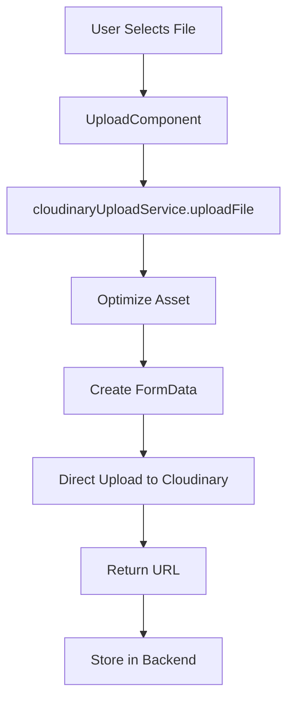

# Cloudinary Integration Guide

**Last Updated:** January 2025  
**Status:** ✅ Production Ready  
**Related Files:** 
- `interface/partner-app/services/cloudinaryUploadService.ts`
- `interface/partner-app/components/ui/UploadComponent.tsx`

---

## Overview

The TiffinWale Partner App uses **Cloudinary** for direct client-side file uploads (images, videos, documents) with upload presets. This document details the integration architecture, common issues, and troubleshooting guide.

## Architecture

### Upload Flow



### Key Design Decisions

1. **Upload Preset Approach** (Not Backend Signature)
   - ✅ Simple and secure
   - ✅ No backend API calls needed
   - ✅ Works identically to student app

2. **Client-Side Direct Upload**
   - Files upload directly from frontend to Cloudinary
   - Backend only stores the returned URL
   - Reduces server load

3. **Automatic Image Optimization**
   - Images resized to max 2000px
   - 90% JPEG compression
   - Maintains quality while reducing file size

---

## Configuration

### Environment Variables

```env
# Required for web
EXPO_PUBLIC_CLOUDINARY_CLOUD_NAME=dols3w27e
EXPO_PUBLIC_CLOUDINARY_API_KEY=your_key
EXPO_PUBLIC_CLOUDINARY_API_SECRET=your_secret
EXPO_PUBLIC_CLOUDINARY_UPLOAD_PRESET=tiffin-wale

# Required for mobile
CLOUDINARY_CLOUD_NAME=dols3w27e
CLOUDINARY_API_KEY=your_key
CLOUDINARY_API_SECRET=your_secret
CLOUDINARY_UPLOAD_PRESET=tiffin-wale
```

### Cloudinary Settings

- **Cloud Name:** `dols3w27e`
- **Upload Preset:** `tiffin-wale` (unsigned)
- **Folder Structure:** `partner-app/{category}/filename`
- **Organization:** All partner app assets are stored under `partner-app/` prefix to separate from student app assets (`student-app/`)

---

## Upload Types

The service supports multiple upload types with preset configurations:

```typescript
export enum UploadType {
  PROFILE_IMAGE = 'profile-images',
  REVIEW_IMAGE = 'review-images',
  REVIEW_VIDEO = 'review-videos',
  REPORT_IMAGE = 'report-images',
  MEAL_IMAGE = 'meal-images',
  DOCUMENT = 'documents',
  BUSINESS_DOCUMENT = 'business-documents',
  LICENSE_DOCUMENT = 'license-documents',
  CERTIFICATE_DOCUMENT = 'certificate-documents',
  GENERAL = 'uploads'
}
```

### Default Settings by Type

| Type | Folder | Dimensions | Crop | Quality |
|------|--------|-----------|------|---------|
| PROFILE_IMAGE | partner-app/profile-images | 300x300 | fill | auto |
| REVIEW_IMAGE | partner-app/review-images | 800x600 | fit | auto |
| MEAL_IMAGE | partner-app/meal-images | 600x400 | fill | auto |
| DOCUMENT | partner-app/documents | 1200px | fit | auto |
| BUSINESS_DOCUMENT | partner-app/business-documents | 1200px | fit | auto |
| LICENSE_DOCUMENT | partner-app/license-documents | 1200px | fit | auto |
| CERTIFICATE_DOCUMENT | partner-app/certificate-documents | 1200px | fit | auto |

---

## Platform-Specific Handling

### Web Platform

```typescript
if (isWeb) {
  // Convert blob URL to File object
  const response = await fetch(optimizedUri);
  const blob = await response.blob();
  file = new File([blob], fileName, {
    type: isVideo ? 'video/mp4' : 'image/jpeg'
  });
}
```

**Critical:** Always convert to a proper `File` object. Never pass `{uri, type, name}` objects to FormData on web.

### Mobile Platform

```typescript
else {
  // Use React Native file format
  file = {
    uri: optimizedUri,
    type: isVideo ? 'video/mp4' : 'image/jpeg',
    name: fileName,
  } as any;
}
```

**Critical:** Use the `{uri, type, name}` object format for React Native.

---

## Common Issues & Solutions

### Error: "Unsupported source URL: [object Object]"

**Root Cause:** File object passed to FormData is not properly formatted.

**Solutions:**

1. **Web:** Ensure blob URLs are converted to `File` objects:
   ```typescript
   // ❌ WRONG - Only handles data: URLs
   if (isWeb && optimizedUri.startsWith('data:')) {
     // Convert...
   }
   
   // ✅ CORRECT - Handles all web URLs
   if (isWeb) {
     const response = await fetch(optimizedUri);
     const blob = await response.blob();
     file = new File([blob], fileName, { type: 'image/jpeg' });
   }
   ```

2. **Do NOT set Content-Type manually:**
   ```typescript
   // ❌ WRONG - Causes [object Object] error
   fetch(url, {
     method: 'POST',
     body: formData,
     headers: { 'Content-Type': 'multipart/form-data' }, // Missing boundary!
   });
   
   // ✅ CORRECT - Let browser set it automatically
   fetch(url, {
     method: 'POST',
     body: formData,
     // No Content-Type header
   });
   ```

3. **Use hardcoded MIME types:**
   ```typescript
   // ❌ WRONG - Complex MIME type detection
   const mimeType = this.getMimeTypeFromExtension(fileExtension);
   file = { uri, type: mimeType, name };
   
   // ✅ CORRECT - Simple hardcoded types
   file = {
     uri: optimizedUri,
     type: isVideo ? 'video/mp4' : 'image/jpeg', // Hardcoded!
     name: fileName,
   };
   ```

### Error: Upload API Not Called

**Root Cause:** Backend signature method doesn't exist.

**Solution:** Use upload preset approach:
```typescript
// ❌ WRONG - Requires backend endpoint
const { signature, timestamp, api_key } = await api.upload.getUploadSignature({ folder });

// ✅ CORRECT - Use upload preset
formData.append('upload_preset', this.config.uploadPreset);
formData.append('cloud_name', this.config.cloudName);
```

### Error: Upload API Called but Failed

**Debug Steps:**

1. Check configuration:
   ```typescript
   console.log('Config:', {
     cloudName: this.config.cloudName,
     uploadPreset: this.config.uploadPreset,
   });
   ```

2. Check file object:
   ```typescript
   console.log('File object:', {
     uri: file.uri,
     type: file.type,
     name: file.name,
   });
   ```

3. Check FormData payload (in network tab):
   - Verify all required fields are present
   - Ensure file is not `[object Object]`
   - Check upload preset is correct

---

## Troubleshooting Checklist

### Upload Not Working?

- [ ] Configuration loaded (check console logs)
- [ ] Upload preset exists in Cloudinary dashboard
- [ ] File object is proper type (File on web, {uri,type,name} on mobile)
- [ ] No manual Content-Type header set
- [ ] MIME types are hardcoded (image/jpeg or video/mp4)
- [ ] Network tab shows actual file data (not [object Object])
- [ ] Cloudinary API returns success response

### Compare with Student App

The student app (`interface/student-app/services/imageUploadService.ts`) has a **working implementation**. When debugging:

1. Compare file creation logic (lines 521-536 in student app)
2. Compare FormData construction (lines 538-569 in student app)
3. Compare fetch call (lines 576-584 in student app)

### Key Differences from Student App

**None!** The partner app now uses the **exact same approach** as the student app.

---

## API Reference

### `uploadFile(fileUri, uploadType, customOptions, onProgress)`

Main upload method that handles all file types.

**Parameters:**
- `fileUri: string` - Local file URI (blob URL, data URL, or file:// URL)
- `uploadType: UploadType` - Type of upload (PROFILE_IMAGE, MEAL_IMAGE, etc.)
- `customOptions?: Partial<UploadOptions>` - Override default options
- `onProgress?: (progress: number) => void` - Progress callback

**Returns:** `Promise<UploadResult>`

**Example:**
```typescript
const result = await cloudinaryUploadService.uploadFile(
  fileUri,
  UploadType.MEAL_IMAGE,
  { folder: 'partner-images/logos' },
  (progress) => console.log(`Upload: ${progress * 100}%`)
);

if (result.success) {
  console.log('URL:', result.url);
  console.log('Public ID:', result.publicId);
}
```

### `deleteImage(publicId)`

Deletes an image from Cloudinary (placeholder implementation).

**Note:** Currently returns success without actually deleting. Implement backend deletion if needed.

---

## Best Practices

### 1. Always Check Configuration

```typescript
const configStatus = cloudinaryUploadService.getConfigStatus();
if (!configStatus.configured) {
  Alert.alert('Config Error', `Missing: ${configStatus.missing.join(', ')}`);
  return;
}
```

### 2. Use Type-Specific Folders with `partner-app/` Prefix

```typescript
// ✅ GOOD - Organized by type under partner-app/
{ folder: 'partner-app/meal-images' }

// ❌ BAD - Flat structure without prefix
{ folder: 'uploads' }
```

**Important:** All partner app assets are stored under the `partner-app/` folder to separate them from student app assets (`student-app/`) in the Cloudinary dashboard.

### 3. Handle Upload Progress

```typescript
await uploadFile(uri, type, options, (progress) => {
  setUploadProgress(progress * 100);
  updateUI('Uploading...');
});
```

### 4. Error Handling

```typescript
try {
  const result = await uploadFile(uri, type);
  if (!result.success) {
    throw new Error(result.error);
  }
} catch (error) {
  console.error('Upload failed:', error);
  Alert.alert('Error', 'Upload failed. Please try again.');
}
```

---

## File Structure

```
interface/partner-app/
├── services/
│   └── cloudinaryUploadService.ts  # Main service
├── components/
│   └── ui/
│       └── UploadComponent.tsx     # UI component
└── memory-bank/
    └── 10_CLOUDINARY_INTEGRATION.md  # This document
```

---

## Related Documentation

- [Cloudinary Upload API](https://cloudinary.com/documentation/image_upload_api)
- [React Native FormData](https://reactnative.dev/docs/network#formdata)
- [Expo Image Manipulator](https://docs.expo.dev Aversions/latest/sdk/imagemanipulator/)

---

## History

**January 2025** - Initial implementation with upload preset approach  
**January 2025** - Fixed "[object Object]" error by properly handling blob URLs on web  
**January 2025** - Removed backend signature approach, aligned with student app

---

## Notes for Future Developers

1. **DO NOT** add Content-Type header manually when using FormData
2. **DO NOT** use complex MIME type detection - stick to `image/jpeg` and `video/mp4`
3. **ALWAYS** handle web and mobile platforms differently for file creation
4. **DO NOT** remove the `if (isWeb)` check - it's critical for cross-platform support
5. If uploads stop working, check the student app implementation first

---

*This document should be updated whenever the Cloudinary integration is modified.*

