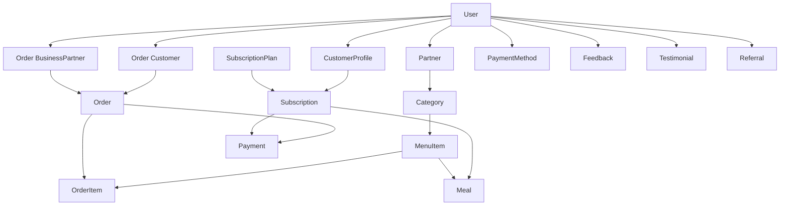

# 📊 Data Relationships & Schema Design

This document explains how different collections in the Tiffin Wale database are related and how the seeder maintains referential integrity.

## 🔗 Entity Relationship Overview



## 📋 Collection Details

### 👥 User (Base Entity)
**Purpose**: Central user management for all roles
**Relationships**:
- **1:1** with Partner (for business users)
- **1:1** with CustomerProfile (for customer users)
- **1:Many** with Orders (as customer)
- **1:Many** with Orders (as business partner)
- **1:Many** with PaymentMethods
- **1:Many** with Feedback
- **1:Many** with Testimonials

**Key Fields**:
```typescript
{
  email: string,           // Unique identifier
  role: UserRole,          // ADMIN, BUSINESS, CUSTOMER, SUPER_ADMIN
  firstName: string,
  lastName: string,
  phoneNumber: string,
  isActive: boolean
}
```

### 🏪 Partner
**Purpose**: Restaurant/food service provider profiles
**Parent**: User (role: BUSINESS)
**Children**: Category, MenuItem
**Relationships**:
- **Many:1** with User (businessPartner)
- **1:Many** with Category
- **1:Many** with MenuItem
- **1:Many** with Orders (as business partner)

**Key Fields**:
```typescript
{
  user: ObjectId,              // Reference to User
  businessName: string,
  description: string,
  cuisineTypes: string[],
  address: Address,
  businessHours: BusinessHours,
  status: PartnerStatus,
  averageRating: number,
  totalReviews: number
}
```

### 👤 CustomerProfile
**Purpose**: Extended customer information and preferences
**Parent**: User (role: CUSTOMER)
**Relationships**:
- **1:1** with User
- **1:Many** with Subscriptions
- **1:Many** with Orders

**Key Fields**:
```typescript
{
  user: ObjectId,                    // Reference to User
  city: string,
  college: string,
  branch: string,
  graduationYear: number,
  dietaryPreferences: string[],
  favoriteCuisines: string[],
  deliveryAddresses: Address[]
}
```

### 🍽️ Category
**Purpose**: Food categories for organizing menu items
**Parent**: Partner
**Children**: MenuItem
**Relationships**:
- **Many:1** with Partner
- **1:Many** with MenuItem

**Key Fields**:
```typescript
{
  name: string,                   // e.g., "Breakfast", "Lunch"
  description: string,
  businessPartner: ObjectId,      // Reference to User (business)
  isActive: boolean
}
```

### 🥘 MenuItem
**Purpose**: Individual food items with pricing and details
**Parents**: Partner, Category
**Relationships**:
- **Many:1** with Partner (businessPartner)
- **Many:1** with Category
- **Many:Many** with Orders (through OrderItems)
- **Many:Many** with Meals

**Key Fields**:
```typescript
{
  name: string,
  description: string,
  price: number,
  businessPartner: ObjectId,       // Reference to User
  category: ObjectId,              // Reference to Category
  isAvailable: boolean,
  tags: string[],
  allergens: string[],
  nutritionalInfo: NutritionalInfo
}
```

### 📋 SubscriptionPlan
**Purpose**: Predefined meal plans with pricing
**Children**: Subscription
**Relationships**:
- **1:Many** with Subscriptions

**Key Fields**:
```typescript
{
  name: string,                    // e.g., "Basic Daily Plan"
  description: string,
  price: number,
  discountedPrice: number,
  durationValue: number,
  durationType: DurationType,      // DAY, WEEK, MONTH, YEAR
  mealFrequency: MealFrequency,    // DAILY, WEEKDAYS, etc.
  mealsPerDay: number
}
```

### 📝 Subscription
**Purpose**: Customer subscriptions to meal plans
**Parents**: CustomerProfile, SubscriptionPlan
**Children**: Meal, Payment
**Relationships**:
- **Many:1** with User (customer)
- **Many:1** with SubscriptionPlan
- **1:Many** with Meals
- **1:Many** with Payments

**Key Fields**:
```typescript
{
  customer: ObjectId,              // Reference to User
  plan: ObjectId,                  // Reference to SubscriptionPlan
  status: SubscriptionStatus,      // ACTIVE, PAUSED, etc.
  startDate: Date,
  endDate: Date,
  totalAmount: number,
  isPaid: boolean
}
```

### 🛒 Order
**Purpose**: Individual food orders from customers
**Parents**: Customer, Partner
**Children**: Payment
**Relationships**:
- **Many:1** with User (customer)
- **Many:1** with User (businessPartner)
- **1:Many** with OrderItems (embedded)
- **1:1** with Payment

**Key Fields**:
```typescript
{
  customer: ObjectId,              // Reference to User
  businessPartner: ObjectId,       // Reference to User
  items: OrderItem[],              // Embedded array
  totalAmount: number,
  status: OrderStatus,
  deliveryAddress: string,
  isPaid: boolean,
  paymentDetails: PaymentDetails
}
```

### 🍽️ Meal
**Purpose**: Scheduled meals for subscription deliveries
**Parents**: Subscription, Partner, MenuItem
**Relationships**:
- **Many:1** with User (customer)
- **Many:1** with User (businessPartner)
- **Many:Many** with MenuItem

**Key Fields**:
```typescript
{
  type: MealType,                  // BREAKFAST, LUNCH, DINNER
  scheduledDate: Date,
  menuItems: ObjectId[],           // References to MenuItem
  status: MealStatus,              // SCHEDULED, PREPARING, etc.
  customer: ObjectId,              // Reference to User
  businessPartner: ObjectId        // Reference to User
}
```

### 💳 Payment
**Purpose**: Payment records for orders and subscriptions
**Parents**: Order OR Subscription
**Relationships**:
- **Many:1** with User (customer)
- **1:1** with Order OR Subscription (polymorphic)

**Key Fields**:
```typescript
{
  customerId: ObjectId,            // Reference to User
  amount: number,                  // In paise
  status: PaymentStatus,
  type: PaymentType,               // ORDER or SUBSCRIPTION
  referenceId: ObjectId,           // Order or Subscription ID
  razorpayPaymentId: string,
  paidAt: Date
}
```

### 💳 PaymentMethod
**Purpose**: Saved payment methods for customers
**Parent**: Customer
**Relationships**:
- **Many:1** with User (customer)

**Key Fields**:
```typescript
{
  customerId: ObjectId,            // Reference to User
  type: PaymentMethodType,         // CARD, UPI, WALLET
  isDefault: boolean,
  tokenId: string,
  // Type-specific fields (last4, upiId, etc.)
}
```

## 🔄 Data Flow & Dependencies

### Seeding Order (Critical for Referential Integrity)

1. **Users** → Creates base user accounts
2. **Partners** → Links to business users
3. **CustomerProfiles** → Links to customer users
4. **Categories** → Links to partners
5. **MenuItems** → Links to categories and partners
6. **SubscriptionPlans** → Standalone meal plans
7. **Subscriptions** → Links customers to plans
8. **Orders** → Links customers to partners with menu items
9. **Meals** → Links subscriptions to menu items and partners
10. **Payments** → Links to orders and subscriptions
11. **PaymentMethods** → Links to customers
12. **Feedback** → Links to customers
13. **Marketing Data** → Links to customers where applicable

### Cross-Collection Relationships

#### User-Centric Relationships
```typescript
// A single customer user connects to:
User (customer) → {
  CustomerProfile,
  Subscriptions[],
  Orders[] (as customer),
  PaymentMethods[],
  Payments[],
  Feedback[],
  Testimonials[],
  Referrals[]
}

// A single business user connects to:
User (business) → {
  Partner,
  Categories[],
  MenuItems[],
  Orders[] (as business partner),
  Meals[] (as business partner)
}
```

#### Business Flow
```typescript
Partner → Categories[] → MenuItems[] → {
  OrderItems[] (in Orders),
  MealItems[] (in Meals)
}
```

#### Customer Journey
```typescript
Customer → {
  // Subscription path
  Subscription → SubscriptionPlan → Meals[] → MenuItems[],
  
  // Order path  
  Orders[] → OrderItems[] → MenuItems[],
  
  // Payment path
  Payments[] → (Orders[] | Subscriptions[])
}
```

## 🔍 Query Patterns

### Common Relationship Queries

#### Get all orders for a customer with partner details:
```typescript
const orders = await Order.find({ customer: userId })
  .populate('businessPartner', 'firstName lastName')
  .populate('customer', 'firstName lastName email');
```

#### Get all menu items for a partner:
```typescript
const menuItems = await MenuItem.find({ businessPartner: partnerId })
  .populate('category', 'name description');
```

#### Get active meals for a customer:
```typescript
const meals = await Meal.find({ 
  customer: userId, 
  status: { $in: ['scheduled', 'preparing'] }
})
  .populate('menuItems', 'name price')
  .populate('businessPartner', 'businessName');
```

#### Get subscription with plan details:
```typescript
const subscription = await Subscription.findById(subscriptionId)
  .populate('customer', 'firstName lastName email')
  .populate('plan', 'name description price');
```

## ⚠️ Important Constraints

### Referential Integrity Rules

1. **User Deletion**: Must cascade to related Partner or CustomerProfile
2. **Partner Deletion**: Must handle Categories and MenuItems
3. **Category Deletion**: Must update related MenuItems
4. **MenuItem Deletion**: Must check for active Orders and Meals
5. **Subscription Cancellation**: Must handle future Meals
6. **Order Status**: Cannot delete Orders with associated Payments

### Data Consistency Guidelines

1. **User Role Validation**: Business users must have Partner profile
2. **Customer Profile**: Customer users should have CustomerProfile
3. **Menu Item Availability**: Check before creating Orders/Meals
4. **Payment Amount**: Must match Order/Subscription total
5. **Subscription Status**: Active subscriptions must have future Meals
6. **Partner Status**: Only approved partners can receive orders

## 🛠️ Maintenance Considerations

### Regular Cleanup Tasks

1. **Expired Subscriptions**: Archive or clean up old subscriptions
2. **Completed Orders**: Archive old delivered orders
3. **Past Meals**: Clean up meals older than 30 days
4. **Failed Payments**: Retry or mark as failed
5. **Inactive Users**: Handle dormant accounts

### Performance Optimization

1. **Indexes**: Create compound indexes for common queries
2. **Aggregation**: Use MongoDB aggregation for complex reports
3. **Pagination**: Implement pagination for large datasets
4. **Caching**: Cache frequently accessed data like menu items
5. **Connection Pooling**: Optimize database connections

---

**Note**: This schema design supports the complete Tiffin Wale ecosystem including customer apps, partner apps, and admin panels with proper data relationships and referential integrity. 