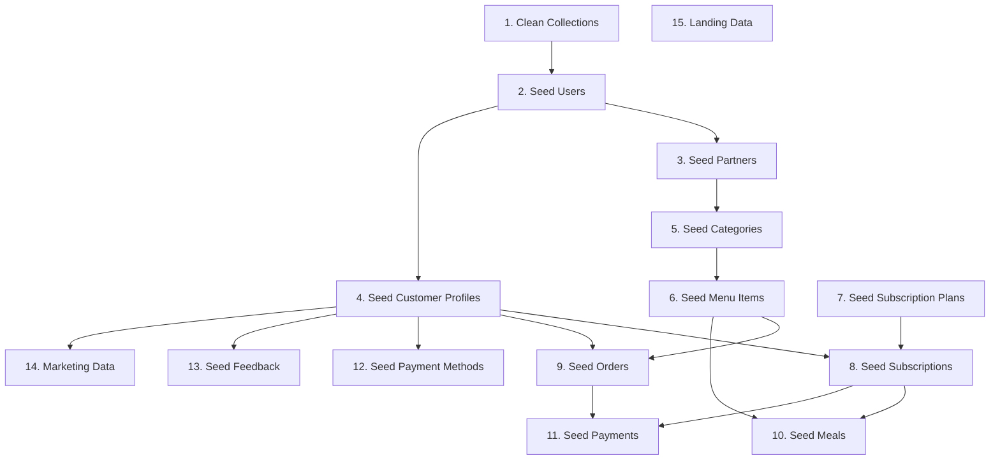

# 🌱 Seeding Strategy & Methodology

This document outlines the comprehensive strategy used for seeding the Tiffin Wale database with realistic dummy data.

## 🎯 Seeding Philosophy

### Core Principles

1. **Realistic Data**: Generate data that closely mimics real-world scenarios
2. **Referential Integrity**: Maintain proper relationships between collections
3. **Scalable Volume**: Create sufficient data for meaningful testing
4. **Diverse Scenarios**: Cover edge cases and various user journeys
5. **Performance Aware**: Optimize seeding process for large datasets

### Design Goals

- **Developer Experience**: Provide rich data for frontend development
- **Testing Coverage**: Support all application features with relevant data
- **Demo Ready**: Create presentation-worthy data for stakeholders
- **Performance Testing**: Generate sufficient volume for load testing
- **Data Relationships**: Ensure all foreign key relationships are valid

## 📊 Data Volume Strategy

### Volume Distribution

| Collection | Target Count | Reasoning |
|------------|--------------|-----------|
| Users | 67 | Mix of roles for comprehensive testing |
| Partners | 15 | Sufficient variety without overwhelming |
| Categories | 45-60 | 3-4 per partner for realistic catalog |
| Menu Items | 225-480 | 5-8 per category for rich selection |
| Customer Profiles | 50 | All customers have complete profiles |
| Subscription Plans | 4 | Standard business offering |
| Subscriptions | ~30 | 60% of customers have subscriptions |
| Orders | ~120 | Active order history for testing |
| Meals | ~210 | 7 days of future meals |
| Payments | ~150 | Cover all paid transactions |

### Scaling Considerations

- **Memory Usage**: Large datasets processed in batches
- **Database Performance**: Optimized insert operations
- **Relationship Complexity**: Balanced depth vs. performance
- **Development Speed**: Quick seeding for rapid iteration

## 🔄 Seeding Order & Dependencies

### Critical Dependency Chain



### Why This Order Matters

1. **Foundation First**: Users are the base entity for all relationships
2. **Profile Completion**: Partners and CustomerProfiles extend user data
3. **Business Structure**: Categories before MenuItems maintains hierarchy
4. **Transaction Flow**: Plans before Subscriptions, Items before Orders
5. **Financial Records**: Payments reference completed transactions
6. **Support Data**: Feedback and marketing build on customer relationships

## 🎲 Data Generation Strategies

### Realistic Data Patterns

#### User Demographics
```typescript
// Realistic distribution
const userDistribution = {
  customers: 74.6%,      // 50/67 users
  business: 22.4%,       // 15/67 users  
  admin: 1.5%,           // 1/67 users
  superAdmin: 1.5%       // 1/67 users
};

// Geographic distribution
const cities = [
  "Mumbai", "Delhi", "Bangalore", 
  "Chennai", "Hyderabad", "Pune", "Kolkata"
];

// Educational background
const colleges = ["IIT", "NIT", "BITS", "State Universities"];
```

#### Business Patterns
```typescript
// Cuisine variety
const cuisineTypes = [
  "North Indian", "South Indian", "Chinese", 
  "Italian", "Mexican", "Thai", "Continental"
];

// Realistic pricing (₹80-₹400)
const priceRanges = {
  breakfast: { min: 80, max: 200 },
  lunch: { min: 120, max: 300 },
  dinner: { min: 150, max: 400 },
  snacks: { min: 60, max: 150 }
};
```

#### Order Behavior
```typescript
// Order status distribution
const orderStatusDistribution = {
  delivered: 60%,        // Most orders completed
  pending: 15%,          // Current orders
  confirmed: 10%,        // In progress
  preparing: 8%,         // Active preparation
  ready: 4%,             // Ready for delivery
  cancelled: 3%          // Failed orders
};

// Payment success rate
const paymentSuccessRate = 80%;
```

### Faker.js Integration

#### Smart Data Generation
```typescript
// Contextual names for restaurants
const businessName = faker.company.name() + " Restaurant";

// Realistic phone numbers
const phoneNumber = faker.phone.number('+91-##########');

// Proper email domains
const email = faker.internet.email(
  firstName.toLowerCase(), 
  lastName.toLowerCase(), 
  'gmail.com'
);

// Indian postal codes
const postalCode = faker.location.zipCode('######');
```

#### Relationship-Aware Generation
```typescript
// Customer orders from their city's restaurants
const localPartners = partners.filter(p => 
  p.address.city === customer.city
);

// Menu items match category themes
const categorySpecificItems = generateMenuItems(
  category.name, // "Breakfast" → breakfast foods
  partner.cuisineTypes // Indian cuisine → Indian dishes
);
```

## 🔗 Relationship Management

### Foreign Key Strategy

#### Parent-Child Relationships
```typescript
// Always create parent before child
const user = await createUser(userData);
const partner = await createPartner({
  ...partnerData,
  user: user._id  // Reference to parent
});
```

#### Many-to-Many Relationships
```typescript
// OrderItems reference MenuItems
const orderItems = selectedMenuItems.map(item => ({
  mealId: item._id,
  quantity: faker.number.int({ min: 1, max: 3 }),
  price: item.price * quantity
}));
```

#### Polymorphic Relationships
```typescript
// Payments can reference Orders OR Subscriptions
const payment = {
  customerId: customer._id,
  type: PaymentType.ORDER,  // or PaymentType.SUBSCRIPTION
  referenceId: order._id,   // or subscription._id
  amount: order.totalAmount
};
```

### Data Consistency Rules

#### Business Logic Validation
```typescript
// Only approved partners receive orders
const approvedPartners = partners.filter(p => 
  p.status === PartnerStatus.APPROVED
);

// Only available menu items in orders
const availableItems = menuItems.filter(item => 
  item.isAvailable === true
);

// Active subscriptions generate meals
const activeSubscriptions = subscriptions.filter(sub => 
  sub.status === SubscriptionStatus.ACTIVE
);
```

#### Cross-Collection Validation
```typescript
// Customer orders from their delivery area
const deliverablePartners = partners.filter(p => 
  isDeliverable(p.address, customer.deliveryAddress)
);

// Subscription meals use plan's meal frequency
const mealsPerWeek = calculateMealsPerWeek(
  plan.mealFrequency,
  plan.mealsPerDay
);
```

## 🎨 Realistic Scenario Creation

### Customer Journey Scenarios

#### New Customer Journey
```typescript
const newCustomer = {
  // Recently joined (within 30 days)
  createdAt: faker.date.recent({ days: 30 }),
  
  // Limited order history (1-3 orders)
  orderCount: faker.number.int({ min: 1, max: 3 }),
  
  // No subscription yet
  hasSubscription: false,
  
  // Basic payment method
  paymentMethods: 1
};
```

#### Loyal Customer Journey
```typescript
const loyalCustomer = {
  // Long-term customer (6+ months)
  createdAt: faker.date.past({ years: 1 }),
  
  // Extensive order history (20+ orders)
  orderCount: faker.number.int({ min: 20, max: 50 }),
  
  // Active subscription
  hasActiveSubscription: true,
  
  // Multiple payment methods
  paymentMethods: faker.number.int({ min: 2, max: 4 }),
  
  // Feedback provided
  hasFeedback: faker.datatype.boolean(0.8)
};
```

### Business Scenarios

#### Successful Restaurant
```typescript
const successfulPartner = {
  status: PartnerStatus.APPROVED,
  isFeatured: true,
  averageRating: faker.number.float({ min: 4.2, max: 5.0 }),
  totalReviews: faker.number.int({ min: 100, max: 500 }),
  isAcceptingOrders: true,
  menuItemCount: faker.number.int({ min: 20, max: 40 })
};
```

#### New Restaurant
```typescript
const newPartner = {
  status: PartnerStatus.PENDING,
  isFeatured: false,
  averageRating: 0,
  totalReviews: 0,
  isAcceptingOrders: false,
  menuItemCount: faker.number.int({ min: 5, max: 15 })
};
```

### Transaction Scenarios

#### Peak Hour Orders
```typescript
// Lunch rush (12 PM - 2 PM)
const lunchOrders = generateOrders({
  timeWindow: { start: '12:00', end: '14:00' },
  volume: 'high',
  categories: ['Lunch', 'Fast Food'],
  averageOrderValue: 250
});

// Dinner orders (7 PM - 9 PM)
const dinnerOrders = generateOrders({
  timeWindow: { start: '19:00', end: '21:00' },
  volume: 'high',
  categories: ['Dinner', 'Beverages'],
  averageOrderValue: 300
});
```

## 🔧 Implementation Details

### Batch Processing Strategy

#### Memory-Efficient Seeding
```typescript
// Process in batches to avoid memory issues
const BATCH_SIZE = 100;
const totalItems = 500;

for (let i = 0; i < totalItems; i += BATCH_SIZE) {
  const batch = generateMenuItems(BATCH_SIZE);
  await MenuItemModel.insertMany(batch);
  console.log(`Processed batch ${i / BATCH_SIZE + 1}`);
}
```

#### Error Handling
```typescript
try {
  const result = await Model.insertMany(documents);
  console.log(`✅ Created ${result.length} ${collectionName}`);
} catch (error) {
  console.error(`❌ Error seeding ${collectionName}:`, error);
  // Continue with next collection
}
```

### Performance Optimizations

#### Database Operations
```typescript
// Use insertMany for bulk operations
await UserModel.insertMany(users);  // Fast
// vs
// await Promise.all(users.map(u => new UserModel(u).save()));  // Slow

// Clean collections in parallel
await Promise.all([
  UserModel.deleteMany({}),
  PartnerModel.deleteMany({}),
  OrderModel.deleteMany({})
]);
```

#### Memory Management
```typescript
// Store only essential references
private users: User[] = [];  // Keep for relationships
private partners: Partner[] = [];  // Keep for relationships

// Don't store large collections
// private menuItems: MenuItem[] = [];  // Would use too much memory
```

### Type Safety

#### Proper TypeScript Typing
```typescript
// Cast insertMany results for type safety
this.users = (await this.userModel.insertMany(usersToCreate)) as User[];

// Use proper enum values
status: faker.helpers.arrayElement(Object.values(OrderStatus)),

// Type-safe relationship references
businessPartner: partner.user as ObjectId,
```

## 📈 Testing & Validation

### Data Quality Checks

#### Relationship Validation
```typescript
// Verify all partners have business users
const businessUsers = users.filter(u => u.role === UserRole.PARTNER);
const partnersCount = partners.length;
assert(businessUsers.length >= partnersCount, "Partner-User mismatch");

// Verify all menu items have valid categories
const menuItemsWithoutCategory = menuItems.filter(item => 
  !categories.some(cat => cat._id.equals(item.category))
);
assert(menuItemsWithoutCategory.length === 0, "Orphaned menu items");
```

#### Business Logic Validation
```typescript
// Verify order totals match item prices
orders.forEach(order => {
  const calculatedTotal = order.items.reduce((sum, item) => 
    sum + item.price, 0
  );
  assert(calculatedTotal === order.totalAmount, "Order total mismatch");
});
```

### Performance Monitoring

#### Seeding Metrics
```typescript
const startTime = Date.now();
await seedUsers();
const userSeedTime = Date.now() - startTime;

console.log(`Users seeded in ${userSeedTime}ms`);
console.log(`Average: ${userSeedTime / userCount}ms per user`);
```

## 🔮 Future Enhancements

### Planned Improvements

1. **Configurable Volumes**: Environment-based data volumes
2. **Seed Profiles**: Different seeding scenarios (minimal, standard, extensive)
3. **Incremental Seeding**: Add data without full reset
4. **Regional Data**: City-specific restaurants and preferences
5. **Seasonal Menus**: Time-based menu item availability
6. **Advanced Analytics**: Business intelligence dummy data

### Extensibility

#### Custom Seed Functions
```typescript
// Plugin architecture for custom seeding
interface SeederPlugin {
  name: string;
  dependencies: string[];
  seed(): Promise<void>;
}

class CustomDataSeeder implements SeederPlugin {
  name = 'custom-business-data';
  dependencies = ['users', 'partners'];
  
  async seed() {
    // Custom seeding logic
  }
}
```

---

**Note**: This seeding strategy ensures comprehensive, realistic data that supports all Tiffin Wale application features while maintaining performance and data integrity. 